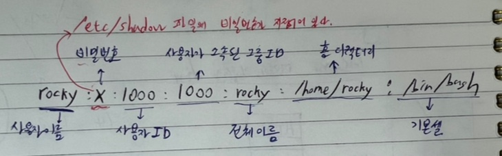
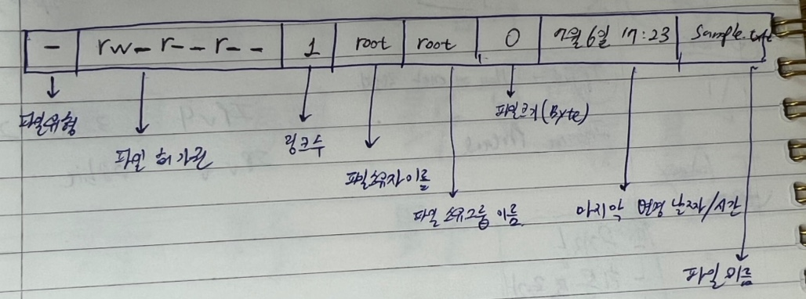

## 사용자 관리와 파일 속성


### 사용자와 그룹

- 리눅스는 **다중 사용자 시스템(multi-user system)**
- 1대의 리눅스에 여러 명의 사용자가 동시에 접속해서 사용할 수 있다.
- root 사용자에게 시스템의 모든 작업을 실행할 수 있는 권한과 시스템에 접속할 수 있는 사용자를 생성할 수 있는 권한이 있다.

- */etc/passwd* 파일에서 각 행의 의미
  - 사용자 이름:비밀번호:사용자ID:사용자가 소속된 그룹ID:전체 이름:홈 디렉터리:기본 셀



- */etc/group* 파일에서 각 행의 의미
  - 그룹 이름:비밀번호:그룹ID:그룹에 속한 사용자 이름
  - 마지막 '그룹에 속한 사용자 이름'은 참조로 사용, 해당 부분에 아무것도 써 있지 않다고 해서 그룹에 소속된 사용자가 반드시 없다는 뜻은 아니다.


#### useradd(또는 adduser)

> 새로운 사용자를 추가

- 이 명령을 실행하면 */etc/passwd*, */etc/shadow*, */etc/group* 파일에 새로운 행이 추가된다.

```shell
$ useradd newuser	// newuser라는 이름의 사용자 생성
$ useradd -u 1111 newuser	// newuser 사용자를 생성하면서 사용자 ID를 1111로 생성
$ useradd -g mygroup newuser	// newuser 사용자를 생성하면서 mygroup 그룹에 newuser 사용자를 포함(mygroup 그룹을 먼저 만들어야함)
$ useradd -d /newhome newuser	// newuser 사용자를 생성하면서 홈 디렉터리를 /newhome으로 지정
$ useradd -s /bin/csh newuser	// newuser 사용자를 생성하면서 기본 셸을 /bin/csh 로 지정
```


#### passwd

> 사용자의 비밀번호를 지정하거나 변경

```shell
$ passwd newuser	// newuser 사용자의 비밀번호를 지정(또는 변경)
```


#### usermod

> 사용자의 속성을 변경

```shell
$ usermod -g root newuser	// newuser 사용자의 그룹을 root 그룹으로 변경
```


#### userdel

> 사용자를 삭제

```shell
$ userdel - newuser	// newuser 사용자를 삭제
$ userdel -r newuser	// newuser 사용자를 삭제하면서 홈 디렉터리까지 삭제
```


#### chage

> 사용자의 비밀번호를 주기적으로 변경하도록 설정

```shell
$ chage -l newuser	// newuser 사용자에 설정된 사항을 확인
$ chage -m 2 newuser	// newuser 사용자에 설정한 비밀번호를 사용해야 하는 최소 일자. 변경 후 최소 2일은 사용해야 함
$ chage -M 30 newuser	// newuser 사용자에 설정한 비밀번호를 사용할 수 있는 최대 일자. 변경 후 최대 30일까지 사용할 수 있음
$ chage -E 2030/12/12 newuser	// newuser 사용자에 설정한 비밀번호가 만료되는 날짜. 2030/12/12까지만 사용할 수 있음
$ chage -W 10 newuser	// newuser 사용자에 설정한 비밀번호가 만료되기 전에 경고하는 기간. 지정하지 않을 경우 기본 값은 7일, 비밀번호 만료되기 10일 전부터 경고 메시지가 나감
```


#### groups

> 사용자가 소속된 그룹을 표시

```shell
$ groups	// 현재 사용자가 소속된 그룹을 표시
$ groups newuser	// newuser가 소속된 그룹을 표시
```


#### groupadd

> 새로운 그룹을 생성

```shell
$ groupadd newgroup	// newgroup이라는 그룹을 생성
$ groupadd -g 2222 newgroup	// newgroupd 그룹을 생성하면서 그룹 ID를 2222로 지정
```


#### groupmod

> 그룹의 속성을 변경

```shell
$ groupmod -n mygroup newgroup // newgroup 그룹의 이름을 mygroup 으로 변경
```


#### groupdel

> 그룹을 삭제

```shell
$ groupdel newgroup	// newgroup 그룹을 삭제. 해당 그룹을 주요 그룹으로 지정한 사용자가 없어야 함
```


#### groupwd

> 그룹의 비밀번호를 설정하거나 그룹 관리를 수행

```shell
$ groupwd newgroup	// newgroup 그룹의 비밀번호를 지정
$ groupwd -A newuser newgroup	// newuser 사용자를 newgroup 그룹의 관리자로 지정
$ groupwd -a user1 newgroup // user1을 newgroup 그룹의 사용자로 추가
$ groupwd -d user1 newgroup // user1을 newgroup 그룹의 사용자에서 제거
```


---


### 파일과 디렉터리의 소유와 허가권

- 리눅스는 각각의 파일과 디렉터리마다 소유권과 허가권이라는 속성이 있다.
- *ls -l*



#### 파일 유형

- 파일의 종류를 나타낸다.
- d(디렉터리), -(일반적인 파일), b(블록 디바이스), c(문자 디바이스), l(링크), ..
- 블록 디바이스: 하드디스크, 플로피 디스크, CD/DVD
- 문자 디바이스: 마우스, 키보드, 프린터 등의 입출력장치

#### 파일 허가권

- 파일을 읽고, 쓰고, 실행할 수 있는 권한을 나타낸다.
- 9개의 문자로 구성되어 있으며, rx-, r--, r-- 3개씩 끊어 읽는다.
- r: read, w: write, x: execute
- 첫번째는 소유자(user)의 파일 접근 권한, 두번째는 그룹(group)의 파일 접근 권한, 세번째는 그 외 사용자(other)의 파일 접근 권한을 의미한다.

